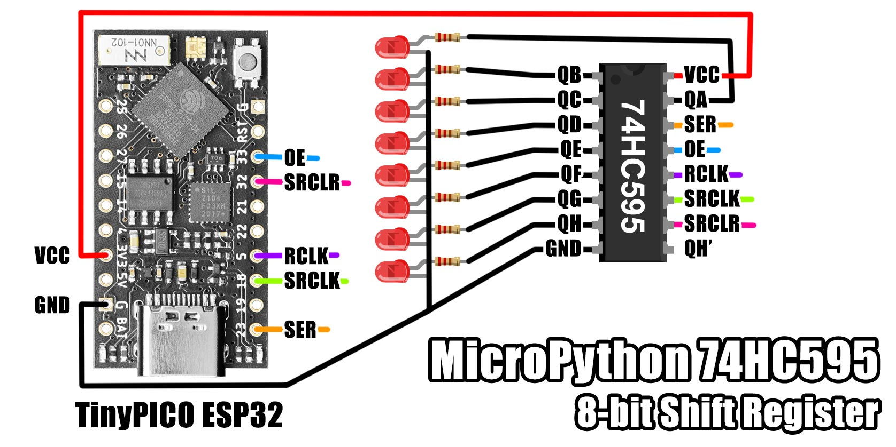

# MicroPython 74HC595

A MicroPython library for 74HC595 8-bit shift registers.

There's both an SPI version and a bit-bang version, each with a slightly
different interface. See below.




### Installation

Using mip via mpremote:

```bash
$ mpremote mip install github:mcauser/micropython-74hc595
$ mpremote mip install github:mcauser/micropython-74hc595/examples
```

Using mip directly on a WiFi capable board:

```python
>>> import mip
>>> mip.install("github:mcauser/micropython-74hc595")
>>> mip.install("github:mcauser/micropython-74hc595/examples")
```

Manual installation:

Copy `src/sr74hc595_bitbang.py` and `src/sr74hc595_spi.py` to the root directory of your device.


## SPI Version

You can use either HSPI or SPI. This version is significantly faster than the
bit-bang version, but is limited to writing whole bytes of data.


### SPI Example

**Basic Usage**

```python
from machine import Pin, SPI
from sr74hc595 import SR74HC595_SPI

spi = SPI(1, 100000)
rclk = Pin(5, Pin.OUT)

oe = Pin(33, Pin.OUT, value=0)    # low enables output
srclr = Pin(32, Pin.OUT, value=1) # pulsing low clears data

sr = SR74HC595_SPI(spi, rclk, 2) # chain of 2 shift registers

sr.pin(2,1)  # set pin 2 high of furthest shift register
sr.pin(2)    # read pin 2
sr.pin(2,0)  # set pin 2 low

sr.toggle(8) # toggle first pin of closest shift register

sr[0] = 0xff # set all pins high on furthest shift register
sr[1] = 240  # set half pins high on closest shift register
sr[1]        # read pins

oe.value(0)  # disable outputs
oe.value(1)  # enable outputs

# pulse to clear shift register memory
srclr.value(1)
srclr.value(0)
```

### SPI Methods

Construct with a reference to `spi` and the `rclk` pin used for latching and an
optional number of cascading shift registers.

Pins `srclr` and `oe` are optional.
If you don't need to clear the outputs, connect `srclr` to vcc.
If you don't need to disable the outputs, connect `oe` to gnd.

```python
__init__(spi, rclk, length=1, srclr=None, oe=None)
```

Read the boolean value of a pin. First pin is index `0`. If you are cascading shift
registers, the first pin of the second shift register is index `8` and so on. Index
`0-7` are the furthest away shift register from the serial data in.

```python
pin(index)
```

Writes a boolean value to a pin. This updates the internal buffer of pin values then
writes all of the values to each shift register in the chain.

```python
pin(index, value, latch=True)
```

This toggles a single pin by index. Helper for reading a pin then writing the opposite
value.

```python
toggle(index, latch=True)
```

This lets you treat the class like a list, where each index represents a whole shift
register. Returns an 8-bit value for the shift register by index, where lowest index
is furthest away.

```python
__getitem__(index)
```

Write an 8-bit value to a shift register at the given index.

```python
__setitem__(index, value)
```

Private method for sending the entire internal buffer over SPI.

```python
_write(latch=False)
```

Private method for pulsing the `rclk` pin, which latches the outputs from the shift
register to the storage register and makes the outputs appear.

```python
_latch()
```


## Bit Bang Version

This version lets you have greater control over sending individual bits of data
at the expense of the performance you get using SPI.

### Bit Bang Example

**Basic Usage**

```python
from machine import Pin
from sr74hc595 import SR74HC595_BITBANG

ser = Pin(23, Pin.OUT)
rclk = Pin(5, Pin.OUT)
srclk = Pin(18, Pin.OUT)

# construct without optional pins
sr = SR74HC595_BITBANG(ser, srclk, rclk)

sr.clear()  # raises RuntimeError because you haven't provide srclr pin
sr.enable() # raises RuntimeError because you haven't provide oe pin

# reconstruct with all pins
oe = Pin(33, Pin.OUT, value=0)    # low enables output
srclr = Pin(32, Pin.OUT, value=1) # pulsing low clears data

sr = SR74HC595_BITBANG(ser, srclk, rclk, srclr, oe)

sr.bit(1)  # send high bit, do not latch yet
sr.bit(0)  # send low bit, do not latch yet
sr.latch() # latch outputs, outputs=0000_0010

sr.bit(1, 1) # send high bit and latch, outputs=0000_0101
sr.bit(0, 1) # send low bit and latch, outputs=0000_1010

sr.bits(0xff, 4) # send 4 lowest bits of 0xff (sends 0x0f), outputs=1010_1111

sr.clear(0) # clear the memory but don't latch yet
sr.latch()  # next latch shows the outputs have been reset

sr.bits(0b1010_1010, 8) # write some bits
sr.clear()  # clear the memory and latch, outputs have been reset

sr.enable()  # outputs enabled
sr.enable(0) # outputs disabled
```

### Bit Bang Methods

Construct with references to each of the pins needed to write to the shift register(s).

Pins `ser`, `srclk` and `rclk` are required. Pins `srclr` and `oe` are optional.
If you don't need to clear the outputs, connect `srclr` to vcc.
If you don't need to disable the outputs, connect `oe` to gnd.

```python
__init__(ser, srclk, rclk, srclr=None, oe=None)
```

Writes a single value and can optionally latch to make it visible.

```python
bit(value, latch=False)
```

Write multiple (`num_bits`) values from the supplied value and optionally can latch.

```python
bits(value, num_bits, latch=False)
```

Pulses the `rclk` pin to latch the outputs. Without this, all of the bits you have
written are remain hidden.

```python
latch()
```

Clears the shift register memory by pulsing the `srclr` pin. You will get a runtime
error unless you have provided this pin on construct.

```python
clear(latch=True)
```

Toggles the output of the shift register by toggling the output enable (`oe`) pin.
You will get a runtime error unless you have provided this pin on construct.

```python
enable(enabled=True)
```

Private method for pulsing the `srclk` pin, which tells the shift register to read
the current state of the `ser` pin and copy it to the shift register memory.

```python
_clock()
```


## Chaining

You can connect multiple 74HC595 shift registers together to form a chain.

Connect each shift registers `rclk`, `srclk`, `oe` and `srclr` together.
If you don't need to disable outputs, you can tie each `oe` to ground.
If you don't need to clear any outputs, you can tie each `srclr` to vcc.

Your micro controller provides data to just the first shift registers `ser` pin.

The `QH\`` output pin on the first shift register goes into the next shift register
`ser` pin and so on.

When clocking in data, the values appear on the closest shift register to the
micro controller first, before overflowing into each chained shift register.


## Parts

* [TinyPICO](https://www.tinypico.com/)
* [74HC595 DIP-16](https://s.click.aliexpress.com/e/_DnLBdpL)
* [74HC595 breakout](https://s.click.aliexpress.com/e/_Der4vyZ)


## Connections

TinyPICO       | 74HC595
-------------- | -------
3V3            | VCC
G              | GND
G (or a pin)   | OE
23 MOSI        | SER
18 SCK         | SRCLK
5              | RCLK
3V3 (or a pin) | SRCLR

Pin   | Name                   | Description
----- | ---------------------- | -----------
OE    | Output Enable          | Active low. Drive high to disable outputs.
SER   | Serial Input           | Serial data sent LSB first.
RCLK  | Storage Register Clock | Pulse to latch data to outputs.
SRCLK | Shift Register Clock   | Serial input is read on rising edge.
SRCLR | Shift Register Clear   | Active low. Drive/tie high to retain contents.
QA-QH | Outputs                | 8 output pins
QH\`  | Serial Output          | Connect to the next 74HC595 SER pin


## Links

* [TinyPICO Getting Started](https://www.tinypico.com/gettingstarted)
* [micropython.org](http://micropython.org)
* [74HC595 datasheet](docs/sn74hc595n.pdf)


## License

Licensed under the [MIT License](http://opensource.org/licenses/MIT).

Copyright (c) 2021 Mike Causer
